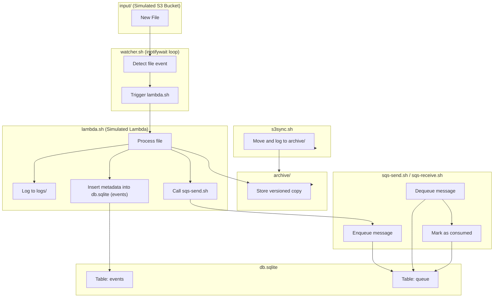

# AWS-like Systems Simulation — Bare Metal DevOps Training

**Project Codename:** `cloudless-aws-simulation`

**Instructor:** Mike Niner Bravog

**Objective:** Simulate core AWS primitives using only shell scripts, SQLite, and native Linux tooling.

**Environment:** Custom VPS at `bravog.com` — no cloud dependencies.

---

## Purpose

This Proof of Concept (POC) is designed as a **DevOps training simulation**, where engineers will learn to reproduce the functionality of key AWS services — without using AWS.

By building everything from scratch, the team will gain real-world expertise in:

* System orchestration using `bash` and `make`
* Event-driven execution using `inotify`
* Object storage workflows (like S3) using native tools
* Key-Value storage (like DynamoDB) using SQLite
* Stateless compute (like Lambda) using shell functions
* Message queuing and dispatching using SQLite + Bash (SQS simulation)
* Logging, versioning, and minimal observability

---

## What We Simulate from AWS

| AWS Service         | Simulated Behavior                         | Tools Used                            |
| ------------------- | ------------------------------------------ | ------------------------------------- |
| **Amazon S3**       | Object storage (upload, versioning, sync)  | `cp`, `rsync`, file timestamps        |
| **AWS Lambda**      | Trigger function on event (new file)       | `inotifywait`, `bash`, `cron`, `trap` |
| **Amazon DynamoDB** | Lightweight key-value database             | `sqlite3`, `bash`, `JSON`             |
| **Amazon SQS**      | Message queue with enqueue/dequeue pattern | `sqlite3`, `bash`, `stdin/stdout`     |

This POC simulates **event-driven pipelines** where files dropped into a storage bucket (`input/`) trigger compute logic (`lambda.sh`), which in turn logs the operation, stores metadata in a lightweight database, and can enqueue messages for further processing.

---

## Project Layout

```
cloudless-aws-simulation/
├── input/                  # Simulated S3 bucket (monitored directory)
├── logs/                   # Lambda execution logs
├── db.sqlite               # Simulated DynamoDB + SQS metadata
├── archive/                # Archived files after sync
├── watcher.sh              # inotifywait loop triggering lambda
├── lambda.sh               # Simulated AWS Lambda function (bash)
├── s3sync.sh               # Sync and archive script (S3 behavior)
├── sqs-send.sh             # Simulated enqueue (SQS send message)
├── sqs-receive.sh          # Simulated dequeue (SQS receive message)
├── Makefile                # Controlled execution and setup
└── README.md               # This file
```

---



## Training Goals

1. **Understand Cloud Abstractions** by reproducing them from scratch.
2. **Master File-based Event Triggers** using native Linux tools.
3. **Simulate Serverless Execution** with clear logs and stateless behavior.
4. **Implement Key-Value Storage** using SQLite, not managed cloud databases.
5. **Develop CI/CD-Compatible Pipelines** entirely offline.
6. **Build Queue-based Messaging Systems** using local tools (SQS style)

---

## Example Use Case (Scenario)

1. DevOps engineer uploads a new file into `input/`.
2. `watcher.sh` (running with `inotifywait`) detects the file.
3. It invokes `lambda.sh`, passing the filename as input.
4. `lambda.sh`:

   * Logs the event to `logs/`
   * Hashes and stores metadata into `db.sqlite`
   * Optionally moves the file to a new location using `s3sync.sh`
   * Can enqueue a message into the SQLite-based queue (`sqs-send.sh`)
5. A separate consumer process (`sqs-receive.sh`) pulls and processes messages.
6. Results are traceable, testable, and observable from CLI.

---

## 🛡️ No External Dependencies

This POC uses:

* `bash`
* `sqlite3`
* `coreutils` (cp, mv, sha256sum, etc.)
* `inotify-tools`
* `make` (optional for orchestration)

Everything runs in a **self-contained VPS environment**, without relying on any external API, vendor, or cloud service.

---

## Notes for Trainees

* All logic is modular. Each script can be tested individually.
* Logs are timestamped. Failures are fatal — fail fast, fail loud.
* You are expected to **extend** this POC with additional simulations (e.g., `SNS`, `IAM`, `API Gateway`).
* You're not copying the cloud. You're **reclaiming your infrastructure**.

---

**Built under pressure, in steel, for the field.**

By Mike Niner Bravog
