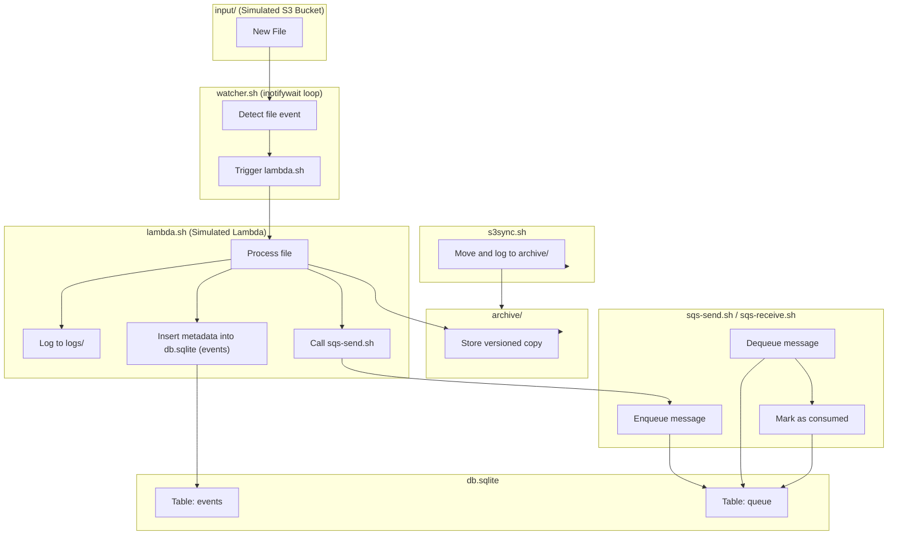

# AWS-like Systems Simulation — Bare Metal DevOps Training

**Codename:** `cloudless-aws-simulation`  
**Instructor:** Mike Niner Bravog  
**Goal:** Simulate essential AWS primitives using Bash, SQLite, and native Linux tooling.  
**Environment:** Standalone VPS on `bravog.com` — 100% cloudless.

---

## Purpose

This Proof of Concept (POC) serves as a DevOps training lab to help engineers **rebuild AWS behaviors from scratch**, without AWS, containers, SDKs, or vendor lock-in.

Through minimal, testable shell modules, this simulation teaches:

- File-based orchestration with `bash` and `make`
- Real-time event triggers using `inotify`
- Object storage logic (S3) via filesystem and archiving
- Stateless compute (Lambda) via modular shell functions
- Key-value storage (DynamoDB) with SQLite
- Queue-based messaging (SQS) with a local DB
- Logging, versioning, and operational traceability

---

## Simulated AWS Services

| AWS Service         | Simulated Behavior                         | Tools Used                            |
|---------------------|--------------------------------------------|----------------------------------------|
| **Amazon S3**       | File storage, versioning, sync             | `cp`, `rsync`, `sha256sum`             |
| **AWS Lambda**      | Triggered execution on file event          | `inotifywait`, `bash`                  |
| **Amazon DynamoDB** | Lightweight key-value storage              | `sqlite3`, `bash`, JSON                |
| **Amazon SQS**      | Message queue (send/receive model)         | `sqlite3`, `bash`, `stdin/stdout`      |

---

## Project Layout

```

cloudless-aws-simulation/
├── input/            # Monitored directory (S3 simulation)
├── archive/          # Versioned storage after sync
├── logs/             # Lambda and sync logs
├── db.sqlite         # SQLite store (DynamoDB + SQS)
├── lambda.sh         # Stateless compute unit
├── watcher.sh        # File monitor and trigger
├── s3sync.sh         # Archive and move processed files
├── sqs-send.sh       # Simulated message enqueue
├── sqs-receive.sh    # Simulated message dequeue
├── Makefile          # Orchestration via CLI
└── README.md         # You're here

````

---

## Requirements

Install these system tools (Debian-based distros):

```bash
sudo apt update
sudo apt install -y bash sqlite3 coreutils inotify-tools
````

**Key components:**

* `bash`: POSIX scripting engine
* `sqlite3`: Embedded database
* `coreutils`: File operations (mv, cp, sha256sum, etc.)
* `inotify-tools`: Real-time file system monitor (`inotifywait`)

> `inotifywait` acts as a sentinel. It listens for filesystem changes and reacts instantly — no polling, no wasted CPU, no external agents.

---

## Workflow Overview

1. A file is placed in `input/` (via `scp`, `curl`, etc).
2. `watcher.sh` detects the event using `inotifywait`.
3. `lambda.sh` is triggered:

   * Computes SHA256
   * Logs to `logs/`
   * Inserts metadata into `db.sqlite`
   * Sends a message to the local queue via `sqs-send.sh`
4. A consumer can run `sqs-receive.sh` to process messages.
5. Running `make sync` or `bash s3sync.sh` moves the file to `archive/`.

---


---

## Real-World Use Cases

| Problem                           | Simulated Solution                        |
| --------------------------------- | ----------------------------------------- |
| Process incoming client documents | File drop → trigger → log + index         |
| Act on sensor or ETL file drops   | Event-driven via inotify                  |
| Immutable audit logging           | SHA256 + timestamp + log + archive        |
| Archiving + version control       | `archive/` naming with content hash       |
| Asynchronous event pipeline       | SQLite queue + consumer script            |
| Offline-ready DevOps system       | Runs on any VPS, no external dependencies |

---

## Mermaid Diagram



---

## Training Goals

1. Understand cloud primitives by building them from scratch.
2. Use Linux-native tools for real-time orchestration.
3. Simulate stateless compute (Lambda) behavior locally.
4. Store structured metadata using local key-value DBs.
5. Build queue-based systems offline (SQS-style).
6. Package workflows using Makefiles and shell modules.

---

## No External Dependencies

This system requires no cloud APIs, SDKs, credentials, containers, or runtimes.
It runs fully self-contained in any Linux VPS — including air-gapped networks.

---

## Next Steps (Optional Extensions)

| Feature        | Purpose                     | Future Module         |
| -------------- | --------------------------- | --------------------- |
| SNS Fanout     | Notify multiple consumers   | `sns-publish.sh`      |
| IAM ACL        | Simulated access control    | `iam-auth.sh`         |
| API Gateway    | File upload via HTTP        | `gateway.sh` + `ncat` |
| Step Functions | State machines and chaining | `step.sh`             |

---

**You're not mimicking the cloud. You're reclaiming your stack.**
— *Built under pressure, in steel, for the field.*

By Mike Niner Bravog