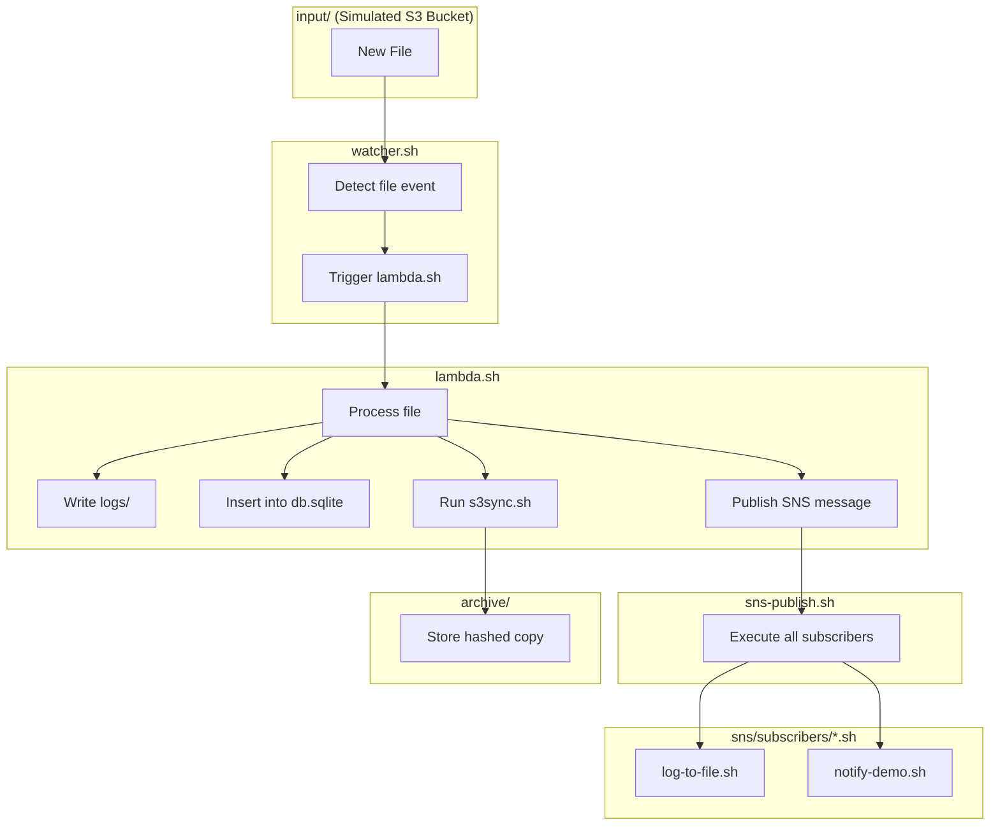

# AWS-like Systems Simulation — Bare Metal DevOps Training

**Codename:** `cloudless-aws-simulation`
**Instructor:** Mike Niner Bravog
**Goal:** Simulate essential AWS primitives using Bash, SQLite, and native Linux tooling.
**Environment:** Standalone VPS on `bravog.com` — 100% cloudless.

---

## Purpose

This Proof of Concept (POC) serves as a DevOps training lab to help engineers **rebuild AWS behaviors from scratch**, without AWS, containers, SDKs, or vendor lock-in.

Through minimal, testable shell modules, this simulation teaches:

* File-based orchestration with `bash` and `make`
* Real-time event triggers using `inotify`
* Object storage logic (S3) via filesystem and archiving
* Stateless compute (Lambda) via modular shell functions
* Key-value storage (DynamoDB) with SQLite
* Queue-based messaging (SQS) with a local DB
* Fan-out messaging with SNS
* Logging, versioning, and operational traceability

---

## Simulated AWS Services

| AWS Service         | Simulated Behavior                   | Tools Used                            |
| ------------------- | ------------------------------------ | ------------------------------------- |
| **Amazon S3**       | File storage, versioning, sync       | `cp`, `rsync`, `sha256sum`            |
| **AWS Lambda**      | Triggered execution on file event    | `inotifywait`, `bash`                 |
| **Amazon DynamoDB** | Lightweight key-value storage        | `sqlite3`, `bash`, JSON               |
| **Amazon SQS**      | Message queue (send/receive model)   | `sqlite3`, `bash`, `stdin/stdout`     |
| **Amazon SNS**      | Fan-out notifications to subscribers | `bash`, file-based subscription model |

---

---

## Project Layout

```
cloudless-aws-simulation/
├── input/              # Monitored directory (S3 simulation)
├── archive/            # Versioned storage after sync
├── logs/               # Lambda and SNS logs
├── sns/                # SNS module (publish/register/topics/subscribers)
├── db.sqlite           # SQLite store (DynamoDB + SQS)
├── lambda.sh           # Stateless compute unit
├── watcher.sh          # File monitor and trigger
├── s3sync.sh           # Archive and move processed files
├── sqs-send.sh         # Simulated message enqueue
├── sqs-receive.sh      # Simulated message dequeue
├── Makefile            # DevOps orchestration CLI
└── README.md           # You're here
```

---

## Module Status

| Module            | Description                             | Status |
| ----------------- | --------------------------------------- | ------ |
| `input/`          | S3-style upload drop zone               | ✅      |
| `lambda.sh`       | Stateless file processor                | ✅      |
| `watcher.sh`      | Real-time trigger via inotify           | ✅      |
| `s3sync.sh`       | Archive and version files               | ✅      |
| `db.sqlite`       | Key-value store (Dynamo-style)          | ✅      |
| `sqs-send.sh`     | Message enqueue (SQS simulation)        | ✅      |
| `sqs-receive.sh`  | Message dequeue and consume             | ✅      |
| `sns-publish.sh`  | Fan-out notification to subscribers     | ✅      |
| `sns-register.sh` | Manual subscriber registration          | ✅      |
| `subscribers/`    | Real-time log + simulated notifications | ✅      |
| `Makefile`        | Full orchestration and automation       | ✅      |
| `README.md`       | Documentation with usage and diagrams   | ✅      |
| `iam-auth.sh`     | Role-based access control (IAM)         | ⏳      |
| `gateway.sh`      | HTTP upload endpoint (API Gateway)      | ⏳      |
| `step.sh`         | Workflow chaining / Step Functions      | ⏳      |

---

## Requirements

Install these system tools (Debian-based distros):

```bash
sudo apt update
sudo apt install -y bash sqlite3 coreutils inotify-tools
```

> `inotifywait` acts as a sentinel. It listens for filesystem changes and reacts instantly — no polling, no wasted CPU, no external agents.

---

## Workflow Overview

1. A file is placed in `input/` (via `scp`, `curl`, etc)
2. `watcher.sh` detects it using `inotifywait`
3. `lambda.sh` is triggered:

   * Computes SHA256
   * Logs to `logs/`
   * Inserts metadata into `db.sqlite`
   * Publishes a fan-out message via SNS
   * Executes subscribers (e.g. logs, notifications)
   * Syncs file to `archive/` using `s3sync.sh`

---

## Usage

This system runs in **fully automated mode**. After the initial `make run`, any file placed in the `input/` directory triggers the entire pipeline — **no further user interaction required**.

---

### Step-by-step Execution

#### 1. Start the system

```bash
make run
```

This will:

* Reset SNS state (`sns-reset`)
* Register all SNS subscribers (`sns-integrate`)
* Launch the file watcher (`watcher.sh`)
* Monitor `input/` in real time

Leave this terminal open — it acts as your **live event monitor**.

---

#### 2. In another terminal, simulate file upload

```bash
cp path/to/any/file.pdf input/myfile.pdf
```

This mimics an S3-style upload. It triggers the full event-driven pipeline:

* `lambda.sh` processes the file:

  * Computes SHA256
  * Logs to `logs/`
  * Stores metadata in `db.sqlite`
  * Publishes a message to the `s3new` SNS topic
* `sns-publish.sh` executes all subscribers:

  * `log-to-file.sh` logs the event
  * `notify-demo.sh` simulates a fan-out (e.g. SMS, webhook, email)
* `s3sync.sh` archives the file into `archive/` using its hash

All outputs are logged **and also printed to the terminal** in verbose mode.

---

#### 3. Observe the results

* **Lambda log:** `logs/myfile.pdf.log`
* **SNS log:** `logs/sns.log`
* **Demo fan-out log:** `logs/sns-demo.log`
* **Archived file:** `archive/<hash>_myfile.pdf`
* **Database check:**

  ```bash
  sqlite3 db.sqlite "SELECT * FROM events;"
  ```

---

### Reset or Clean

* Reset logs and database (keeps archive):

  ```bash
  make reset
  ```

* Wipe everything (full clean):

  ```bash
  make clean
  ```

---

#### 2. Open Terminal #1 — start the watcher

```bash
make run
```

This keeps `watcher.sh` running in the foreground, monitoring `input/` for file events.

---

#### 3. Open Terminal #2 — simulate file upload

```bash
cp path/to/any/file.pdf input/test-demo.pdf
```

Triggers the pipeline:

* `lambda.sh` → process + log + DB
* `sns-publish.sh` → fan-out
* `s3sync.sh` → archive file

---

#### 4. Observe results

* **Logs:**

  * `logs/test-demo.pdf.log` → Lambda trace
  * `logs/sns.log` → Basic SNS log
  * `logs/sns-demo.log` → Simulated fan-out (email, SMS, webhook)

* **Archive:**

  * `archive/<hash>_test-demo.pdf`

* **Database:**

  ```bash
  sqlite3 db.sqlite "SELECT * FROM events;"
  ```

---

### Reset & Clean

```bash
make reset     # Clear logs and DB entries
make clean     # Wipe all data, logs, archives, and DB (DANGER)
```

---

## Real-World Use Cases

| Problem                           | Simulated Solution                        |
| --------------------------------- | ----------------------------------------- |
| Process incoming client documents | File drop → trigger → log + index         |
| Act on sensor or ETL file drops   | Event-driven via inotify                  |
| Immutable audit logging           | SHA256 + timestamp + log + archive        |
| Archiving + version control       | `archive/` naming with content hash       |
| Asynchronous event pipeline       | SQLite queue + consumer script            |
| Offline-ready DevOps system       | Runs on any VPS, no external dependencies |

---

## Mermaid Diagram



---

## Training Goals

* Understand core cloud primitives via local simulation
* Build event-based pipelines using only Bash
* Implement Lambda-style stateless processing
* Use SQLite for structured key-value storage (Dynamo-style)
* Fan-out messages with SNS logic
* Package infrastructure using `make` targets

---

## No External Dependencies

No SDKs, no AWS CLI, no Docker, no API keys.
Runs entirely from a self-hosted Linux box.
Perfect for air-gapped environments, cost-free labs, or DevSecOps drills.

---

## Future Modules

| Feature        | Purpose                | Module        |
| -------------- | ---------------------- | ------------- |
| SNS (done)     | Fan-out pub/sub        | `sns/*.sh`    |
| IAM            | Access control         | `iam-auth.sh` |
| API Gateway    | File upload via HTTP   | `gateway.sh`  |
| Step Functions | State machine chaining | `step.sh`     |

---
## Scalability

This project is designed for simplicity and local execution, but it can scale far beyond proof-of-concept level — without relying on AWS or any external cloud provider.

The architecture supports horizontal scale-out using multiple `watcher.sh` instances across partitioned input directories, and task parallelism can be achieved by introducing lightweight worker queues. SQLite may be replaced with PostgreSQL or Redis for better concurrency, while logging and archiving can be rotated or compressed for long-term retention.

Subscribers in the SNS model can be extended to run across multiple nodes, with inter-process communication over the local network using tools like `socat` or `netcat`. Processing can be batched, offloaded, or distributed depending on volume — all under your control.

With minimal adjustments, this system can support tens of thousands of events per hour — on commodity hardware — at a fraction of the cost of cloud services. You own the stack, the flow, and the runtime.

This is DevOps without a leash.

---

This system avoids the complexity and hidden costs of real cloud stacks.
**Everything runs on metal — with clarity, control, and zero billing surprises.**

---

**You're not mimicking the cloud. You're reclaiming your stack.**
*Built under pressure, in steel, for the field.*

## By **Mike Niner Bravog**
 