# Cloudless AWS Simulation

**Bare Metal DevOps Training Lab**

**Codename:** `cloudless-aws-simulation`

**Author & Instructor:** *Mike Niner Bravog*

> “You're not mimicking the cloud. You're reclaiming your stack.”
> *Built under pressure, in steel, for the field.*

---

## Overview

This project is a **cloudless simulation of AWS core services**, handcrafted entirely with Bash, SQLite, and native Linux tools — no SDKs, no containers, no cloud APIs. It's a standalone lab environment designed for deep DevOps learning and operational clarity.

Whether you're a DevOps engineer, SRE, cloud architect, or systems tinkerer, this training module helps you **understand how cloud-native primitives work — by rebuilding them from the ground up**.

It’s AWS... without AWS.

---

## Project Goals

The primary goal is to simulate key AWS services using **only fundamental Unix/Linux tools**, enabling engineers to:

* Build infrastructure logic from first principles
* Learn the internal behavior of event-driven systems
* Develop cloud-native workflows without vendor lock-in
* Master shell scripting, automation, and system orchestration

This is a **bare metal DevOps dojo**. Every module is transparent, traceable, and inspectable.

---

## What You'll Learn

* **Automation** with `make` and shell modules
* **S3-like object storage** via filesystem + archiving
* **Lambda-like stateless compute** using Bash functions
* **DynamoDB-style key-value store** via SQLite
* **SQS-style queuing system** for async workflows
* **SNS-style fan-out messaging** to subscribers
* **Audit logs & event tracing** via timestamped logs
* **Inotify-based triggers** for zero-polling workflows

All modules can be extended, replaced, or scaled horizontally — the system is modular by design.

---

## Simulated AWS Services

| AWS Service  | Simulated Feature                      | Tooling Used                     |
| ------------ | -------------------------------------- | -------------------------------- |
| **S3**       | File drop, archiving, versioning       | `cp`, `rsync`, `sha256sum`       |
| **Lambda**   | File-triggered stateless computation   | `inotifywait`, `bash`            |
| **DynamoDB** | Key-value and structured event storage | `sqlite3`, `bash`, JSON          |
| **SQS**      | Queued messaging (send + receive)      | `sqlite3`, `bash`                |
| **SNS**      | Pub/Sub system with fan-out delivery   | `bash`, file-based subscriptions |

---

## System Architecture

```
cloudless-aws-simulation/
├── input/              # Simulated S3 drop zone (watched dir)
├── archive/            # Archived files with versioning
├── logs/               # Lambda, SNS, and event logs
├── sns/                # SNS modules + subscribers
├── db.sqlite           # SQLite database for KV and queues
├── lambda.sh           # Stateless compute logic
├── watcher.sh          # Real-time file watcher
├── s3sync.sh           # File versioning + archiving
├── sqs-send.sh         # Message enqueue logic
├── sqs-receive.sh      # Message dequeue handler
├── Makefile            # CLI orchestration interface
└── README.md           # Documentation (you are here)
```

---

## Module Status

| Module            | Role                                    | Status |
| ----------------- | --------------------------------------- | ------ |
| `input/`          | S3-style file drop zone                 | ✅      |
| `lambda.sh`       | Stateless processor (Bash Lambda)       | ✅      |
| `watcher.sh`      | Event detector via `inotify`            | ✅      |
| `s3sync.sh`       | Archive & versioning logic              | ✅      |
| `db.sqlite`       | SQLite store for events and queues      | ✅      |
| `sqs-send.sh`     | Enqueue message to local SQS queue      | ✅      |
| `sqs-receive.sh`  | Dequeue and process messages            | ✅      |
| `sns-publish.sh`  | Publish event to topic subscribers      | ✅      |
| `sns-register.sh` | Register shell subscribers              | ✅      |
| `subscribers/`    | Example subscribers for fan-out         | ✅      |
| `Makefile`        | CLI for automation                      | ✅      |
| `iam-auth.sh`     | IAM role simulation (RBAC / ACL)        | ⏳      |
| `gateway.sh`      | File upload via HTTP (API Gateway-like) | ⏳      |
| `step.sh`         | Step Functions (workflow state machine) | ⏳      |

---

## System Requirements

Install on any Debian-based Linux system:

```bash
sudo apt update
sudo apt install -y bash sqlite3 coreutils inotify-tools
```

> `inotifywait` is a file event sentinel — instant event-driven reactions without polling.

---

## How It Works

1. Place a file in `input/` (e.g., PDF, CSV, JSON)
2. `watcher.sh` detects the new file
3. `lambda.sh` is triggered automatically:

   * Computes SHA256 hash
   * Logs the operation
   * Archives the file
   * Inserts metadata into `db.sqlite`
   * Publishes to `sns` topic (`s3new`)
4. All SNS subscribers are executed (e.g., notify, log)
5. Logs, archive, and DB entries are created in real time

Everything happens **automatically** after a single `make run`.

---

## Quick Start

### 1. Start the system

```bash
make run
```

This:

* Launches the file watcher
* Registers SNS subscribers
* Begins live monitoring of `input/`

---

### 2. Upload a file (from another terminal)

```bash
cp myfile.pdf input/myfile.pdf
```

That’s it. The pipeline begins:

* `lambda.sh` → process
* `sns-publish.sh` → notify
* `s3sync.sh` → archive

---

### 3. Inspect results

```bash
# Logs
cat logs/myfile.pdf.log
cat logs/sns.log
cat logs/sns-demo.log

# Archive
ls archive/

# Database
sqlite3 db.sqlite "SELECT * FROM events;"
```

---

## Maintenance

| Task                             | Command      |
| -------------------------------- | ------------ |
| Reset logs and DB (keep archive) | `make reset` |
| Wipe everything (dangerous)      | `make clean` |

---

## Real-World Use Cases

| Problem                        | Simulated Solution                      |
| ------------------------------ | --------------------------------------- |
| Document intake pipelines      | File drop + event trigger + logging     |
| ETL workflow bootstrapping     | Inotify + fan-out processing            |
| Immutable logs with versioning | SHA256 archive with timestamps          |
| Message-driven pipelines       | SQS + Lambda + SNS                      |
| Audit-compliant workflows      | Full traceability and offline readiness |

---

## Flowchart

```mermaid
flowchart TD
  subgraph S3["input/ (S3 Sim)"]
    FileUpload["📥 File Drop"]
  end

  subgraph Watcher["watcher.sh"]
    Watch["👀 Detect Change"]
    Trigger["⚡ Trigger lambda.sh"]
  end

  subgraph Lambda["lambda.sh"]
    Hash["🔐 Compute Hash"]
    Log["📝 Log to logs/"]
    DB["🧠 Store in SQLite"]
    SNS["📣 Publish to SNS"]
    Archive["📦 Archive File"]
  end

  subgraph SNS["sns-publish.sh"]
    Fanout["🔀 Notify Subscribers"]
  end

  subgraph Subscribers["sns/subscribers/"]
    Logger["📑 log-to-file.sh"]
    Notifier["📬 notify-demo.sh"]
  end

  FileUpload --> Watch --> Trigger --> Hash
  Hash --> Log & DB & SNS & Archive
  SNS --> Fanout --> Logger & Notifier
```



---

## Training Outcomes

After completing this simulation, you’ll be able to:

* Rebuild essential cloud primitives locally
* Automate infrastructure logic with Bash and Make
* Implement zero-polling event pipelines
* Understand pub/sub and queue-driven architecture
* Log, store, and archive operations with full traceability
* Design air-gapped, vendor-free infrastructure for secure ops

---

## No Vendor Lock-In

* ❌ No AWS CLI
* ❌ No Docker
* ❌ No external APIs
* ✅ 100% Offline
* ✅ 100% Linux-native
* ✅ 100% Yours

---

## What's Next?

| Feature            | Description                    | Module        |
| ------------------ | ------------------------------ | ------------- |
| **IAM**            | Simulated access control       | `iam-auth.sh` |
| **API Gateway**    | HTTP endpoint to upload files  | `gateway.sh`  |
| **Step Functions** | Visual workflow chaining       | `step.sh`     |
| **Metrics**        | Runtime stats + Grafana export | TBD           |

---

## ⚙Scalability & Extensibility

This lab starts simple — but scales with your ambition.

* Add worker nodes with `socat`/`netcat` or UNIX sockets
* Replace SQLite with PostgreSQL or Redis for concurrency
* Add queues, shards, or workers for high-throughput ingestion
* Integrate Prometheus or custom metrics for observability
* Store archive files remotely with `rclone`, `rsync`, or `sftp`

You control the limits. You own the stack.

---

## Why This Matters

Cloud vendors abstract away complexity — but that also hides power.

This simulation helps you:

* **Learn how cloud primitives are designed**
* **Avoid dependency on opaque systems**
* **Build muscle-memory for resilient DevOps**

Perfect for:

* ✅ Air-gapped infrastructure
* ✅ Incident response & disaster recovery drills
* ✅ Low-cost experimentation and upskilling
* ✅ Embedded systems and offline edge devices
* ✅ Real-world Linux training bootcamps

---

## About the Founder of this Repository

**Mike Niner Bravog**

Programmer | SysAdmin | DevOps | AI Engineer

Builder of tools, breaker of myths.

Teaching infrastructure clarity — one shell script at a time.

---

## License

This project is licensed under the MIT License.

---

### ⚔️ You’re not just simulating AWS — you’re **reclaiming the cloud**.
